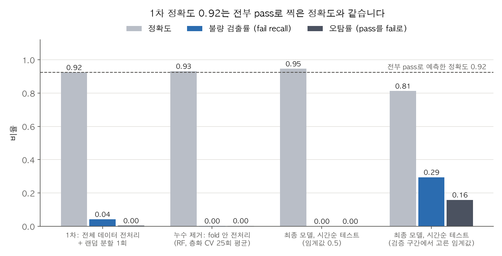
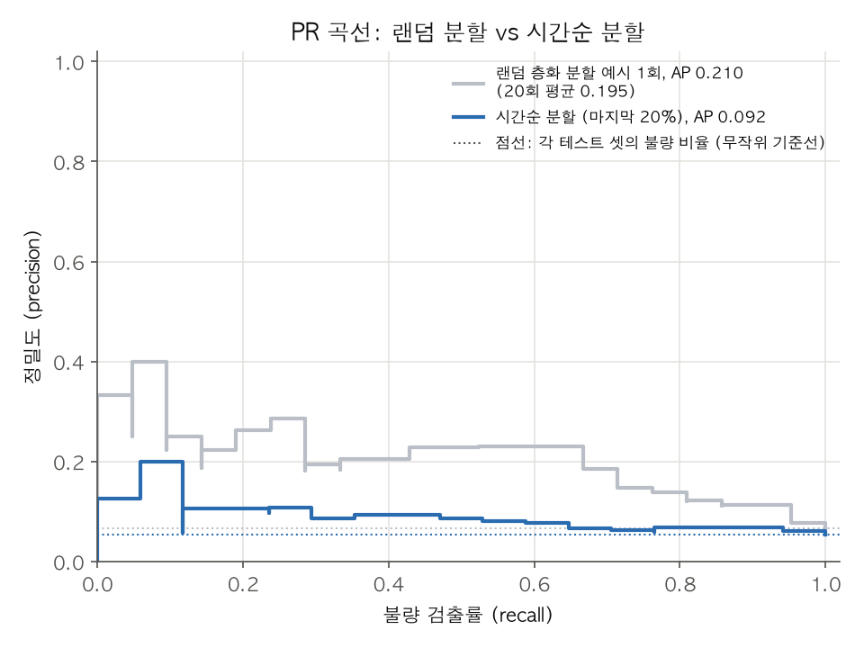
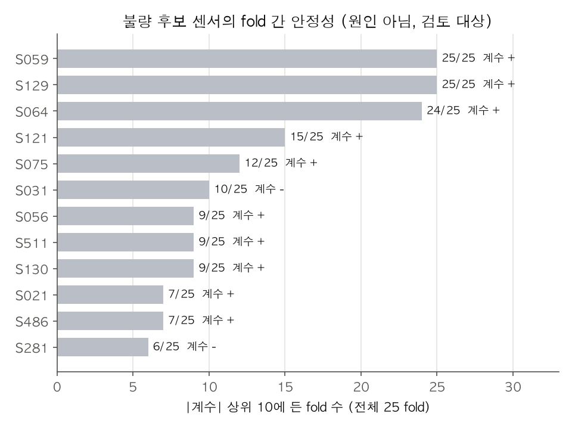

# SECOM 불량 예측: 1차 결과와 검증

## 문제

반도체 공정 센서 데이터로 웨이퍼 불량(fail)을 미리 찾을 수 있는지 봅니다. 빠르게 만든 1차 파이프라인은 정확도 92.4%를 냈습니다. 이 저장소는 그 숫자를 검증 절차로 다시 확인했을 때 무엇이 뒤집혔는지 기록합니다. 모든 수치는 `run_all.py`를 실행해서 나온 값이고, `report/results.json`에 그대로 남습니다.

## 데이터

- 출처: UCI SECOM (https://archive.ics.uci.edu/dataset/179/secom)
- 웨이퍼 1,567개, 센서 열 590개 (UCI 설명에는 591 attributes로 적혀 있지만 `secom.data`의 실제 열 수는 590개입니다)
- fail 104개, 불량 비율 6.64%
- 라벨은 공정 내 검사의 pass/fail입니다. 이 문서에서 "불량"은 이 검사의 fail을 뜻하며, 제조 현장의 최종 불량 판정과 같다고 보지 않습니다
- 측정 시각: 2008-07-19 ~ 2008-10-17, 파일 순서가 이미 시간순입니다
- 전체 셀 중 결측 4.5%, 모든 웨이퍼에 결측이 한 개 이상 있습니다
- 값이 하나뿐인 센서 116개, 결측 50% 초과 센서 28개를 제외하면 446개가 남습니다 (파이프라인 안에서는 학습 fold 기준으로 다시 계산합니다)
- 불량 비율이 시기마다 다릅니다: 7월 22.2%, 8월 9.2%, 9월 2.9%, 10월 6.1%

센서 이름 `S059`는 `secom.data`의 0번부터 센 60번째 열을 뜻합니다.

## 지표

- 불량 검출률 = TP / (TP + FN), 오탐률 = FP / (FP + TN)
- AP(Average Precision, 평균 정밀도)는 `sklearn.metrics.average_precision_score`로 계산합니다. 사다리꼴 적분으로 구한 PR 곡선 아래 면적과는 값이 조금 다를 수 있습니다
- 정확도 기준선(전부 pass로 예측)은 항상 모델과 같은 테스트 셋에서 계산합니다. 1차 테스트 셋(314개, fail 24개)의 기준선이 92.4%이고, 전체 데이터 기준으로는 93.4%입니다

## 재현 방법

```bash
curl -L -o data/secom.zip https://archive.ics.uci.edu/static/public/179/secom.zip
unzip -o data/secom.zip -d data/
uv run python run_all.py      # 또는 make
```

실행 시간은 네 번 실행에서 91~111초였습니다 (macOS, 12코어). 모든 난수 시드는 42로 고정했고 네 번 실행해 같은 숫자를 확인했습니다. 출력은 `report/results.json`, `report/run_output.txt`, 그림 3장입니다.

## 1차 결과

빠른 첫 버전이 흔히 하는 순서를 그대로 따랐습니다.

1. 전체 데이터로 평균값 결측 대체, 표준화, 라벨을 사용한 특징 선택(ANOVA F 상위 40개)
2. 랜덤 80/20 분할 1회
3. RandomForest(트리 300개), 임계값 0.5

| 지표 | 값 |
|---|---|
| 정확도 | 0.924 (290/314) |
| 전부 pass로 예측했을 때 정확도 | 0.924 (290/314) |
| 불량 검출률 | 4.2% (1/24) |
| 오탐률 | 0.3% (1/290) |
| AP | 0.240 |

## 검증에서 뒤집힌 것

| 1차 판단 | 검증 방법 | 결과 |
|---|---|---|
| 정확도 92.4%면 쓸 만하다 | 전부 pass로 찍는 기준선과 비교 | 기준선도 92.4%로 같습니다. 모델이 더한 것이 없습니다 |
| 정확도가 목표 지표다 | 불량 검출률, 오탐률, AP로 교체 | 불량 24개 중 1개만 찾았습니다 (검출률 4.2%) |
| 전처리 순서는 결과에 영향이 없다 | 결측 대체, 표준화, 특징 선택을 학습 fold 안에서만 fit 하는 Pipeline으로 바꾸고 같은 25개 fold(5겹 x 5회)로 비교 | AP 0.199 → 0.159 (표준편차 약 0.04). 전체 데이터에서 라벨로 특징을 고른 탓에 약 0.04 부풀려져 있었습니다 |
| 랜덤 분할 점수가 실제 성능이다 | 시간순 60/20/20 분할(앞 구간 학습, 가운데 구간 임계값 선택, 마지막 구간 테스트)과 같은 비율의 랜덤 층화 분할 20회 비교 | AP 0.195 (20회 범위 0.102~0.347) → 0.092. 테스트 셋 불량 비율 대비 배수로 보면 2.9배 → 1.7배입니다 |
| 임계값 0.5를 그대로 쓴다 | 시간순 검증 구간에서 (검출률 - 오탐률)이 가장 큰 점을 골라 테스트에 적용 | 0.5에서는 테스트 불량 17개 중 0개 검출. 검증 구간에서 고른 0.08에서는 5개 검출(29.4%), 오탐률 15.8% |
| 검증 구간 성능이 테스트에서도 유지된다 | 같은 임계값의 검증 구간과 테스트 구간 비교 | 검출률 54.5%(6/11) → 29.4%(5/17). 오탐률은 14.6% → 15.8%로 비슷했습니다 |

단일 랜덤 분할의 AP 0.240은 25개 fold 평균 0.199보다 높았습니다. 불량이 24개뿐인 테스트 셋 한 번의 점수는 흔들림이 크다는 점도 함께 확인했습니다.

### 모델 선택

모델은 시간순 학습 구간(앞 60%) 안의 층화 CV(5겹 x 5회) AP로만 골랐습니다. 검증 구간(가운데 20%)은 임계값 선택에만, 테스트 구간(마지막 20%)은 최종 측정에만 썼습니다. 처음 버전은 전체 데이터로 CV를 돌려 테스트 구간이 모델 선택에 섞여 있었고, 외부 검토에서 지적받아 고쳤습니다. 고친 뒤에도 선택된 모델과 최종 수치는 같았습니다.

| 후보 (모두 Pipeline 안에서 전처리) | CV AP | 임계값 0.5 검출률 | 임계값 0.5 오탐률 |
|---|---|---|---|
| RandomForest, class_weight=balanced_subsample | 0.237 ± 0.085 | 0.0% | 0.0% |
| L1 로지스틱 회귀, class_weight=balanced | 0.193 ± 0.049 | 55.8% | 25.7% |

RandomForest가 선택되었습니다. 이 모델은 확률을 0.5 위로 거의 내지 않아서 임계값 조정이 필수입니다. 참고로 선택되지 않은 L1 로지스틱 회귀를 사후에 시간순 테스트에 돌려 보면 AP 0.047로 테스트 셋 불량 비율 0.054보다 낮았습니다. 이 수치는 모델 선택에 쓰지 않았습니다.

## 최종 결과

선택 모델(RandomForest, Pipeline 전처리), 시간순 분할의 마지막 20% (2008-10-02 ~ 2008-10-17, 웨이퍼 314개, 불량 17개), 임계값 0.08(검증 구간에서 선택):

| 지표 | 값 |
|---|---|
| 불량 검출률 | 29.4% (5/17) |
| 오탐률 | 15.8% (47/297) |
| AP | 0.092 (무작위 기준선 0.054) |
| 정확도 (참고) | 0.812 |

테스트 구간에서 임계값을 바꾸면 이렇게 움직입니다 (임계값은 검증 구간 점수의 분위수):

| 임계값 | 검출률 | 오탐률 |
|---|---|---|
| 0.053 | 76.5% (13/17) | 64.3% |
| 0.063 | 64.7% (11/17) | 44.1% |
| 0.073 | 47.1% (8/17) | 25.9% |
| 0.087 | 23.5% (4/17) | 12.5% |
| 0.093 | 11.8% (2/17) | 11.1% |

정리하면, 이 데이터와 이 모델로는 미래 구간에서 불량을 안정적으로 골라내지 못합니다. 무작위보다 나은 신호는 있지만 약합니다.




## 불량 후보 센서

방법: 전처리 Pipeline + L1 로지스틱 회귀를 25개 fold(5겹 x 5회)에서 각각 학습하고, 계수 절댓값 상위 10개에 몇 번 들었는지 셉니다. 한 번이라도 상위 10에 든 센서는 53개였습니다. 아래는 상위 12개입니다. 계수 부호는 모든 fold에서 일관되었습니다.

이 목록은 fail과 pass를 통계적으로 가르는 **엔지니어 검토 대상 후보**입니다. 원인이라는 뜻이 아닙니다. 공정 순서, 설비 이력, 측정 방식과 대조해야 의미를 판단할 수 있습니다.

| 센서 | 상위 10 포함 fold | 계수 부호 | pass 중앙값 | fail 중앙값 | 결측 비율 |
|---|---|---|---|---|---|
| S059 | 25/25 | + | 0.722 | 5.522 | 0.4% |
| S129 | 25/25 | + | -0.142 | 0.000 | 0.6% |
| S064 | 24/25 | + | 20.012 | 20.860 | 0.4% |
| S121 | 15/25 | + | 15.790 | 15.810 | 0.6% |
| S075 | 12/25 | + | -0.006 | -0.006 | 1.5% |
| S031 | 10/25 | - | 3.431 | 3.427 | 0.1% |
| S056 | 9/25 | + | 0.931 | 0.932 | 0.3% |
| S511 | 9/25 | + | 0.000 | 278.720 | 0.1% |
| S130 | 9/25 | + | 0.759 | 0.771 | 0.6% |
| S021 | 7/25 | + | -5529.0 | -5447.3 | 0.1% |
| S486 | 7/25 | + | 248.98 | 267.75 | 1.5% |
| S281 | 6/25 | - | 0.0140 | 0.0134 | 0.1% |

계수 부호 +는 다른 센서를 함께 고려한 모델에서 값이 클수록 fail 점수가 올라간다는 뜻입니다. 단독 중앙값 차이와 항상 같은 방향이라는 보장은 없습니다.



## 한계

- 시간순 테스트 셋의 불량은 17개, 검증 구간은 11개입니다. 검출률 1개 차이가 5.9%p(테스트), 9.1%p(검증)이므로 수치의 불확실성이 큽니다.
- 시간순 분할은 한 번만 했습니다. 구간을 옮겨 가며 반복하는 평가는 하지 않았습니다.
- 불량 비율이 시기별로 22.2%에서 2.9%까지 달라집니다. 학습 구간 8.1%, 검증 3.5%, 테스트 5.4%입니다. 성능 하락의 일부는 이 분포 변화 때문일 수 있고, 원인을 분리하지 않았습니다.
- 후보 센서 순위는 전체 기간 데이터로 낸 탐색 결과이며, 성능 평가나 모델 선택에는 쓰지 않았습니다.
- 후보 센서는 L1 로지스틱 회귀 기준이고, 최종 선택 모델은 RandomForest입니다. 두 모델이 다르며, 이 L1 모델은 시간순 테스트에서 무작위 수준이었습니다. 후보 목록은 예측 모델의 설명이 아니라 분리 신호의 탐색 결과로 봐야 합니다.
- 하이퍼파라미터(트리 수, L1 강도 C=0.05, 특징 선택 k=40)는 조정하지 않았습니다.
- 결측 자체가 공정 정보일 수 있지만 결측 여부를 특징으로 쓰지 않았습니다.
- 센서의 물리적 의미가 공개되지 않은 데이터라서 도메인 해석은 할 수 없습니다.
